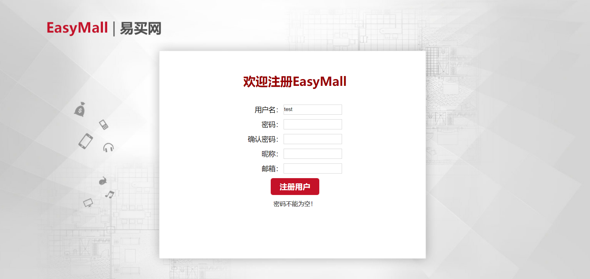
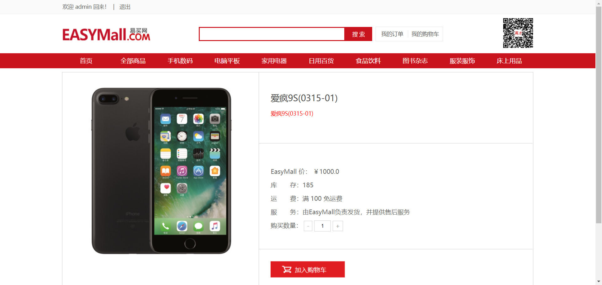
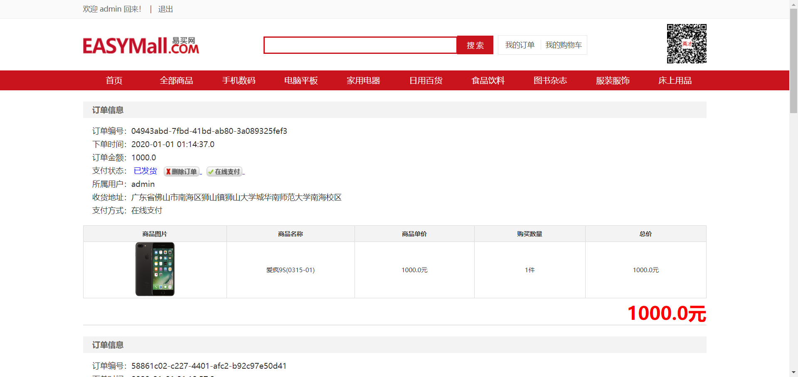
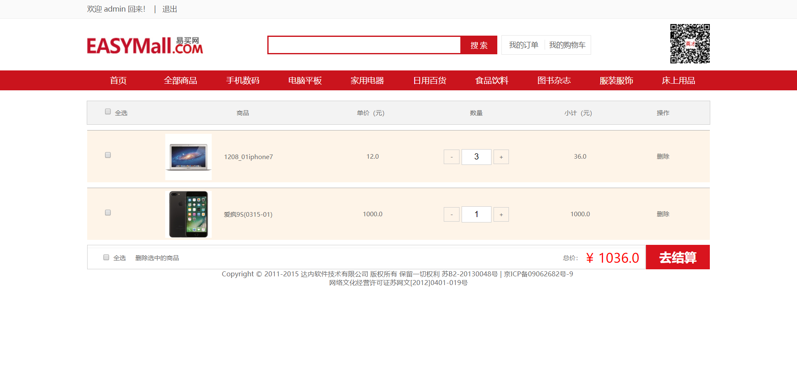
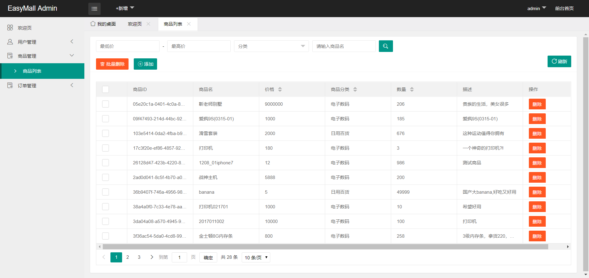
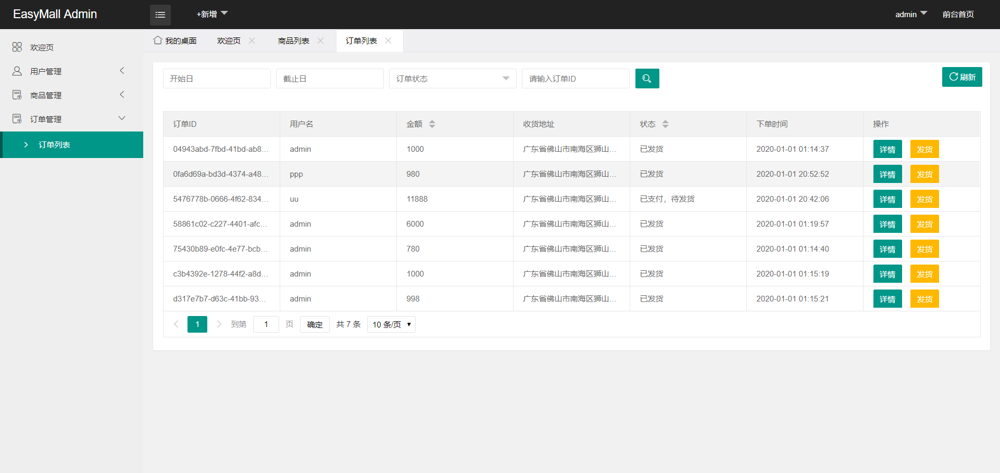
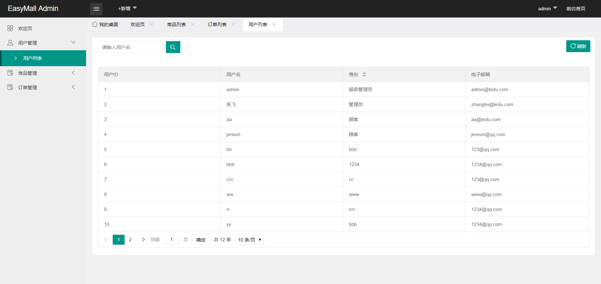

# EasyMallssm
`EasyMallssm`使用SSM框架搭建电子商务平台，网页管理后台使用了X-Admin后台模板。含有登录/注册、购物车、订单、后台等模块。

---

# 示例图片
[所有示例图片](./EXAMPLE/)

---
# 使用
1. 使用git克隆或直接下载该项目
2. 使用`Eclipse`等导入该Java项目
3. 导入`EXAMPLE`文件夹中的`easymall.sql`数据库文件到`mysql`中
3. 由于编译使用的Java版本可能不一致，如果提示错误请根据您电脑的环境修改项目配置
4. 编译并运行

## 改善该项目
1. 提出[Issues](https://github.com/SCNU-A225/EasyMallssm/issues)，告知我们
2. 创建[Pull requests](https://github.com/SCNU-A225/EasyMallssm/pulls)

---
# 更新
暂无更新

# 声明
该项目是练习项目，没有参与任何商业行为。

**若该项目侵害了您的权益请务必通知我们删除该项目！**

# 许可
[Apache License 2.0](https://github.com/SCNU-A225/EasyMallssm/blob/master/LICENSE)

